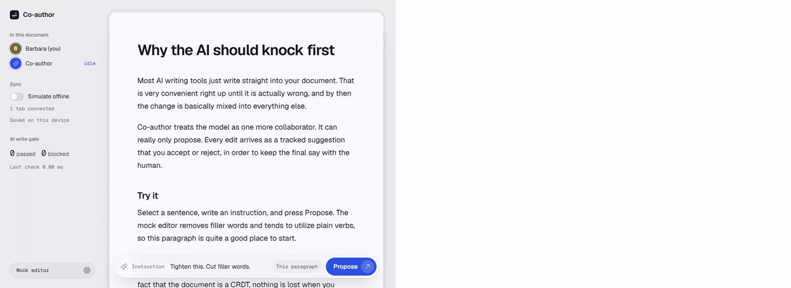
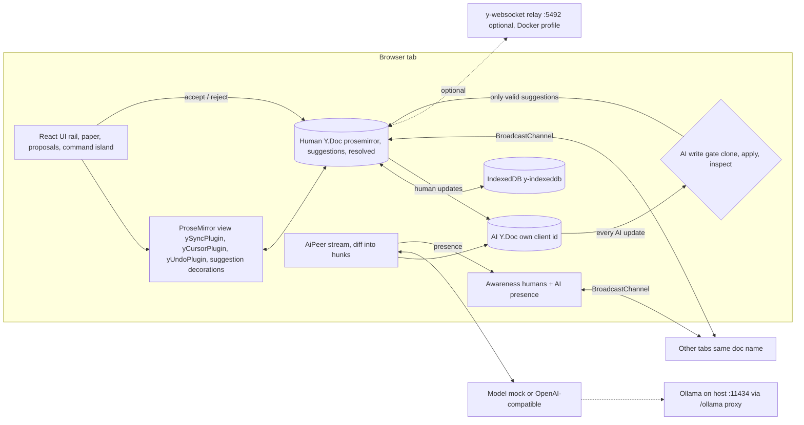

# Co-author

**The AI is just another CRDT peer, and it can only propose.** 32 peers converge in 467.78 ms with every AI write gated (1.114 ms per check on a 50,024 character document).



Recorded with `pnpm demo:record && pnpm demo:gif` (mock model, two tabs synced over BroadcastChannel).

## What it does

- A local-first rich-text editor: ProseMirror bound to a Yjs document, saved in IndexedDB, installable as an offline PWA.
- The AI is a separate Yjs peer with its own client id, name, color and caret. It never touches the text. Every edit it makes is a tracked suggestion.
- Suggestions show up as struck original text with a ghost insert inline, and as cards in a Proposals panel. You accept or reject each one. Accept is a normal undoable transaction.
- Tabs with the same document name sync over BroadcastChannel with no server. Turn on Simulate offline, edit in both tabs, reconnect, and nothing is lost.

## Run it

```bash
pnpm install
pnpm dev                          # http://localhost:5490
docker compose up --build         # built app on http://localhost:5491
docker compose --profile relay up # adds a y-websocket relay on ws://localhost:5492
```

- Add `?ai=mock` to force the deterministic mock model, `?doc=<name>` to pick a document, and `?relay=ws://localhost:5492` to sync across browsers through the relay.
- The default AI backend is the mock. Switch to an OpenAI-compatible endpoint in the model settings. The default is Ollama with model `qwen3.8:27b`, reached through the same-origin path `/ollama/v1`, which the dev server and the Docker image proxy to the host daemon on port 11434.
- If Docker cannot reach Ollama on the host, start Ollama with `OLLAMA_HOST=0.0.0.0`.

## How it works



## Proof

- Tests: `pnpm test` runs 19 files and 102 tests, all passing. `pnpm e2e` runs 2 Playwright tests in Chromium, both passing.
- Measured numbers come from `pnpm bench` (written to `bench/results.json`). Machine: AMD Ryzen 9 7900X 12-Core Processor, 24 cores, Node v24.18.0, win32 10.0.26200. BroadcastChannel latency is measured in Node, not in a browser.

Convergence (full mesh, 100 random edits and 2 gated AI suggestions per peer, median of 5)

| peers | median ms | bytes exchanged |
|---|---|---|
| 2 | 1.05 | 3710 |
| 4 | 4.56 | 22686 |
| 8 | 19.53 | 107660 |
| 16 | 85.43 | 481815 |
| 32 | 467.78 | 2136551 |

Offline divergence merge (two replicas, median of 5)

| edits per side | median ms | bytes |
|---|---|---|
| 100 | 0.27 | 2312 |
| 1000 | 2.86 | 30716 |
| 5000 | 17.66 | 171606 |

Gate cost per AI update (median of 50)

| doc chars | legal ms | illegal ms |
|---|---|---|
| 10064 | 0.356 | 0.396 |
| 50024 | 1.114 | 1.147 |
| 199948 | 4.086 | 4.151 |

BroadcastChannel in Node, 4 providers, 200 edits: median 0.087 ms, p95 0.146 ms.

## Decisions

- [ADR 0001: Yjs + raw ProseMirror with a flat text-block schema](docs/adr/0001-yjs-prosemirror-flat-schema.md)
- [ADR 0002: Suggestions live in a separate Y.Map anchored by RelativePositions](docs/adr/0002-suggestions-layer.md)
- [ADR 0003: The AI peer is a separate Y.Doc behind a fail-closed gate](docs/adr/0003-ai-peer-gate.md)
- [ADR 0004: BroadcastChannel provider + IndexedDB, no server](docs/adr/0004-sync-and-persistence.md)
- [ADR 0005: Accept only applies to the text the AI actually saw](docs/adr/0005-accept-semantics.md)
- [ADR 0006: Stream one draft suggestion, then split into word-level hunks](docs/adr/0006-streaming-then-hunks.md)
- [ADR 0007: Demo seed generated by a fixed client id](docs/adr/0007-deterministic-seed.md)
- [ADR 0008: Plain CSS tokens, Phosphor icons, no Tailwind or motion library](docs/adr/0008-ui-stack.md)
- [ADR 0009: Docker compose for the built app, optional relay, same-origin Ollama proxy](docs/adr/0009-docker-and-ollama-proxy.md)

Developer docs: [docs/DEVDOCS.md](docs/DEVDOCS.md).

## Limits

- Flat schema (headings and paragraphs only) and single-block suggestions.
- Two peers that accept the same suggestion at the same moment both insert the text; the peers agree, but the insert is duplicated.
- Only the local AI peer is gated. Remote human tabs are trusted.
- BroadcastChannel latency is a Node number, not a browser number.
