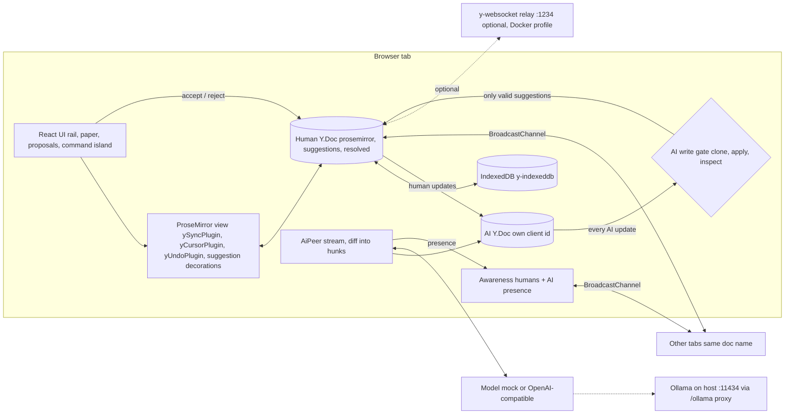

# Co-author developer docs

A local-first collaborative editor where the AI is just another CRDT peer. The AI can only propose: its edits arrive as tracked suggestions that a human accepts or rejects. The model proposes, the deterministic core disposes.

Status: v0.1 planned (spec, plan and ADRs written on 2026-10-03). Results below are targets until the bench runs.

## Overview and goals

Co-author is portfolio project #5. It makes the profile thesis visible: an LLM can suggest, but only deterministic code, driven by a human decision, changes the document.

v0.1 goals:

1. A rich-text editor (ProseMirror) bound to a Yjs document through y-prosemirror.
2. Offline first: IndexedDB persistence, installable PWA.
3. Cross-tab sync over BroadcastChannel with no server. An optional y-websocket relay runs in Docker for cross-browser demos.
4. An AI peer with its own Yjs client id, awareness identity, name, color and caret, writing only into a suggestions layer.
5. A fail-closed gate that rejects any AI update touching anything except valid suggestion entries.
6. Inline tracked changes plus a Proposals panel, with accept and reject. Accept is a normal, undoable Yjs transaction.
7. Two AI backends: an OpenAI-compatible streaming endpoint (default local Ollama, model `qwen3.8:27b`) and a deterministic mock.
8. Measured numbers in the README, never invented ones.

Non-goals for v0.1: multi-block suggestions, lists and tables, accounts, cross-device sync without the relay, gating remote human tabs.

## Architecture



## Components and responsibilities

| Module | Responsibility |
|---|---|
| `src/core/schema.ts` | Root names (`prosemirror`, `suggestions`, `resolved`), transaction origins, limits, the `Suggestion` and `Resolution` types, `validateSuggestion`. |
| `src/core/anchors.ts` | Find blocks and their `Y.XmlText`, read plain text, build and resolve anchored ranges from RelativePositions. |
| `src/core/suggestions.ts` | Derive suggestion state (streaming, ready, conflict, orphan), list open suggestions, accept and reject. |
| `src/core/gate.ts` | `validateAiUpdate` and `connectAiPeer`: two-way wiring between human and AI docs, quarantine on violation, gate stats. |
| `src/ai/aiPeer.ts` | The AI peer: own `Y.Doc` and `Awareness`, streams a draft suggestion, splits it into word-level hunks, honors abort and dismissal. |
| `src/ai/mockModel.ts` | Deterministic copy editor (filler removal, plain verbs) that streams token by token. |
| `src/ai/openaiModel.ts`, `src/ai/sse.ts` | OpenAI-compatible chat completions with streaming, SSE parsing, `<think>` stripping, readable errors. |
| `src/ai/diff.ts` | LCS word diff into hunks. |
| `src/sync/broadcast.ts` | BroadcastChannel provider: state-vector handshake, live updates, awareness relay, connect and disconnect for offline simulation. |
| `src/sync/persistence.ts` | y-indexeddb attachment with a startup timeout. |
| `src/editor/*` | ProseMirror schema, Yjs offset to ProseMirror position mapping, selection scope, suggestion decorations, editor factory. |
| `src/app/session.ts` | Wires doc, awareness, seed, persistence, sync, relay and AI peer; exposes an external store for React. |
| `src/ui/*` | React components and CSS tokens. |
| `bench/run.ts` | Measurements written to `bench/results.json`. |

## Data model

### Y.Doc structure

| Root | Type | Written by | Content |
|---|---|---|---|
| `prosemirror` | `Y.XmlFragment` | humans (editor, accept) | One `Y.XmlElement` per block (`paragraph` or `heading` with `level`), each holding at most one `Y.XmlText`; marks are formatting attributes. |
| `suggestions` | `Y.Map<Suggestion>` | the AI peer (through the gate), humans delete on resolve | Plain JSON objects keyed by id. |
| `resolved` | `Y.Map<Resolution>` | humans | `{ verdict, at, by, original, insert }` per resolved id. |

### Suggestion

```ts
interface Suggestion {
  id: string            // ai-<clientId>-<n> for drafts, ai-<clientId>-<n>.<k> for hunks
  groupId: string       // the draft id shared by its hunks
  author: { kind: 'ai'; clientId: number; name: string }
  from: RelPosJSON      // Y.relativePositionToJSON, assoc 0
  to: RelPosJSON        // assoc -1 (assoc 0 when collapsed)
  original: string      // text under the range when proposed
  insert: string        // replacement text
  instruction: string
  status: 'streaming' | 'ready'
  createdAt: number
}
```

State is derived on read, never stored:

| State | Condition | Accept |
|---|---|---|
| streaming | `status === 'streaming'` | refused |
| ready | anchors resolve in one block and current text equals `original` | allowed |
| conflict | anchors resolve but the text changed | refused |
| orphan | anchors do not resolve (block deleted) | refused, hidden |

### Relative positions

`from` sticks to the first character of the range and `to` to the last, so typing at either boundary stays outside the range, typing inside grows it, deleting the range collapses it (which reads as conflict), and deleting the block makes it unresolvable (orphan). ProseMirror positions are computed from the Yjs block lengths: offset `i` in block `k` is `sum(len(block_j) + 2 for j < k) + 1 + i` (flat schema, ADR 0001).

### Awareness

Each tab's awareness holds the human state `user: { kind: 'human', name, color }` plus a `cursor` from y-prosemirror. The AI peer has its own `Awareness` with `user: { kind: 'ai', name: 'Co-author', color, activity: 'idle' | 'thinking' | 'streaming', caret: RelPosJSON | null }`. The session forwards AI awareness updates into the tab's awareness, so other tabs see the AI too. Human carets render with `yCursorPlugin` (AI states are filtered out); the AI caret renders as its own decoration with a name flag.

## AI peer protocol

The AI peer **may**:

- set a key in `suggestions` to a value that passes `validateSuggestion`, with `author.clientId` equal to its own client id;
- overwrite its own entries (streaming updates) and delete entries (withdraw a draft);
- publish presence in its own awareness.

The AI peer **may not** (each case is rejected and quarantines the peer):

- insert, delete or format anything in `prosemirror`;
- write `resolved` or any other root type;
- write malformed suggestions (wrong id, non-AI author, missing anchors, oversized text, bad status);
- claim another client id as author;
- send updates that depend on state the human doc does not have.

Writes to an id that is already resolved pass the gate but are inert: every reader filters resolved ids and accept refuses them (ADR 0002, 0003).

## Key flows

### Suggest, render, accept or reject

1. The user places the caret or selects text; `scopeFromSelection` gives `{ blockIndex, from, to }` (clamped to one block).
2. `AiPeer.propose` reads the text from its replica, anchors the range, writes a `streaming` draft and sets presence to thinking.
3. Model tokens arrive; at most every `flushMs` (60 ms) the draft's `insert` is overwritten. Each write goes AI doc, then gate, then human doc, then BroadcastChannel to other tabs.
4. The suggestion plugin re-renders on every suggestions, resolved or awareness change: struck original, ghost insert with a blinking caret, AI caret flag.
5. When the stream ends, the output is cleaned and diffed at word level; in one AI transaction the draft is replaced by one `ready` suggestion per hunk. If the scope changed meanwhile, the draft stays whole and shows as conflict.
6. Accept re-derives the state inside a transaction with origin `co-author:accept`: delete the range, insert with the original formatting, delete the suggestion, record the resolution. Ctrl+Z undoes it. Reject only records the resolution and deletes the suggestion.

### Offline, then reconnect

1. "Simulate offline" calls `provider.disconnect()`: the channel closes, remote awareness states are removed, local edits keep landing in IndexedDB.
2. Both tabs edit, and the AI can keep proposing locally.
3. On `connect()`, a tab posts `hello` with its state vector; each peer answers `sync` with the missing diff and its own state vector; the newcomer sends back what that peer lacks. Yjs merges deterministically, so every character from both sides survives and suggestion anchors still resolve.

## Invariants and how tests enforce them

| Invariant | Test |
|---|---|
| The AI cannot change the text, `resolved`, or any other root | `tests/gate.test.ts`: seven attack cases, malformed and spoofed suggestions, quarantine, and a 200-step seeded property test asserting human text never changes |
| Peers converge regardless of order | `tests/convergence.test.ts`: two and three peers, five shuffled delivery orders, a 5-seed x 40-round fuzz with AI suggestions, accepts, rejects and partial syncs |
| Anchors survive concurrent edits outside the range | `tests/anchors.test.ts`, plus cross-peer accept in `tests/suggestions.test.ts` |
| Accept applies only to the text the AI saw | `tests/suggestions.test.ts` (conflict, orphan, streaming refused) and `tests/aiPeer.test.ts` (edit during streaming) |
| Resolved suggestions never come back | `tests/suggestions.test.ts` (rewritten after reject stays hidden) and `tests/aiPeer.test.ts` (reject during streaming) |
| Seeding is idempotent | `tests/seed.test.ts` |
| Offline edits merge with nothing lost | `tests/broadcast.test.ts` (real Node BroadcastChannel) and `tests/persistence.test.ts` (fake-indexeddb reload) |
| ProseMirror positions match the Yjs model | `tests/positions.test.ts` (every offset in a mixed doc) |

## Local dev setup and commands

Requirements: Node 24, pnpm 9.12 (`corepack enable`), Docker Desktop for the container path, optional Ollama on the host at port 11434.

| Task | Command |
|---|---|
| Install | `pnpm install` |
| Dev server | `pnpm dev` then open http://localhost:5175 (`?ai=mock`, `?doc=<name>`, `?relay=ws://localhost:1234`) |
| Unit and integration tests | `pnpm test` |
| Type check | `pnpm typecheck` |
| Production build | `pnpm build`, then `pnpm preview` on http://localhost:5175 |
| End-to-end | `pnpm exec playwright install chromium` once, then `pnpm e2e` |
| Measurements | `pnpm bench` (writes `bench/results.json`) |
| Docker app | `docker compose up --build`, then open http://localhost:5175 |
| Docker relay | `docker compose --profile relay up` (relay on ws://localhost:1234) |

The dev server and the Docker nginx both proxy `/ollama/*` to Ollama (`localhost:11434` in dev, `host.docker.internal:11434` in Docker), so the default base URL `/ollama/v1` works without CORS settings. If Docker cannot reach the host daemon, start Ollama with `OLLAMA_HOST=0.0.0.0`. No AWS services are used, so there is no LocalStack container.

## Testing strategy

- **Core in Node.** Everything in `src/core`, `src/ai` and `src/sync` runs in vitest's Node environment against real Yjs docs. Test docs are built in the exact shape y-prosemirror produces.
- **Property and fuzz tests** with a seeded PRNG (`mulberry32`): the gate property test, the convergence fuzz, the diff round-trip.
- **Real transports.** BroadcastChannel tests use Node 24's built-in channel; persistence tests use `fake-indexeddb`.
- **Decorations in jsdom.** `tests/suggestionPlugin.test.ts` checks positions, classes and button wiring without a browser.
- **One Playwright path** in Chromium: propose with the mock, accept a hunk, and cross-tab sync.
- **TDD order.** Every task in the plan writes the failing test first, then the code, then commits.

## Metrics plan

Targets only. Real results replace this table after `pnpm bench`, with the machine line it prints.

| Metric | How it is measured | Target |
|---|---|---|
| Convergence time | Full-mesh exchange of missing updates across 2, 4, 8, 16 and 32 simulated peers, each with 100 random edits and 2 gated AI suggestions; median of 5; fingerprints must match | 32 peers converge in under 1 s |
| Offline divergence merge | Two replicas with 100, 1000 and 5000 edits each, merged both ways; time and bytes | 5000 edits per side merge in under 250 ms |
| Gate overhead | Median of 50 `validateAiUpdate` calls on 10k, 50k and 200k character docs, legal and illegal updates | Under 5 ms at 50k characters |
| Cross-tab latency | Node BroadcastChannel, 4 providers, 200 edits; median and p95 until all replicas show the edit | Median under 5 ms (Node, not a browser number) |
| Tests | `pnpm test`, `pnpm e2e` pass counts | all green |

## Design direction summary

- Read: a calm, precise product editor ("soft structuralism"), cool neutral canvas, paper in a machined tray.
- Type: Geist Variable for UI and document text, Geist Mono Variable for metadata. Document text 18px with 1.72 line height, 66ch measure.
- Color: cool greys plus one cobalt accent (`#2b54e0`, dark `#7d9bff`) that always means "the AI": inserts, AI avatar and caret, the Propose button. Conflicts use ink tones and a dashed strike, not a second color. Light and dark modes from tokens.
- Shape: double-bezel shells (22px outer, 16px inner), cards 18/13px, inputs 10px, pill buttons, and a button-in-button arrow on Propose.
- Layout: three columns on desktop (rail, paper with a floating command island, Proposals panel), two columns on tablets, one column on phones with a bottom-fixed island.
- Motion: CSS only on transform, opacity and filter with `cubic-bezier(0.32, 0.72, 0, 1)`; cards rise in, the streaming card has a sheen, the streaming insert has a blinking caret; all of it is off under reduced motion.
- Icons: Phosphor light; raw Phosphor SVGs inside editor widgets.

## Milestones

v0.1 (plan tasks, one commit each):

1. Scaffold Vite, React, TypeScript and vitest.
2. Document roots and suggestion schema.
3. Anchored ranges with relative positions.
4. Accept and reject as normal transactions.
5. AI write gate with quarantine.
6. Convergence tests across concurrent peers.
7. Word-level diff.
8. Deterministic mock model.
9. OpenAI-compatible streaming client.
10. The AI peer (streaming drafts, hunks, presence).
11. BroadcastChannel cross-tab sync.
12. IndexedDB persistence and deterministic seed.
13. Position mapping and selection scope.
14. Inline tracked-change decorations.
15. Session wiring.
16. Design tokens, layout and editor surface.
17. Proposals panel and command island.
18. Presence rail, offline switch, gate meter and settings.
19. Installable offline PWA.
20. Playwright happy path.
21. Measurements.
22. Docker compose for the app and the relay.
23. README with measured numbers, DEVDOCS results, handoff.

Stretch, after v0.1:

- Gate updates from remote tabs per sender, not only the local AI peer.
- Deduplicate concurrent double accepts.
- Multi-block suggestions and nested nodes (lists), with y-prosemirror position mapping.
- Compaction of the `resolved` map.
- Sentence-aware hunks and a "re-ask" action for conflicts.
- Publish the gate and anchor core as an npm package (`@co-author/ai-peer`).
- Hosted demo with a recorded GIF.

## Decisions

- [ADR 0001: Yjs + raw ProseMirror with a flat text-block schema](adr/0001-yjs-prosemirror-flat-schema.md)
- [ADR 0002: Suggestions live in a separate Y.Map anchored by RelativePositions](adr/0002-suggestions-layer.md)
- [ADR 0003: The AI peer is a separate Y.Doc behind a fail-closed gate](adr/0003-ai-peer-gate.md)
- [ADR 0004: BroadcastChannel provider + IndexedDB, no server](adr/0004-sync-and-persistence.md)
- [ADR 0005: Accept only applies to the text the AI actually saw](adr/0005-accept-semantics.md)
- [ADR 0006: Stream one draft suggestion, then split into word-level hunks](adr/0006-streaming-then-hunks.md)
- [ADR 0007: Demo seed generated by a fixed client id](adr/0007-deterministic-seed.md)
- [ADR 0008: Plain CSS tokens, Phosphor icons, no Tailwind or motion library](adr/0008-ui-stack.md)
- [ADR 0009: Docker compose for the built app, optional relay, same-origin Ollama proxy](adr/0009-docker-and-ollama-proxy.md)

## Open questions

- How should concurrent double accepts be deduplicated without a server (for example, a deterministic winner by client id that undoes the loser's insert)?
- Should remote tabs also pass a per-sender gate, given that a compromised tab could forge suggestions or text?
- Is the per-update clone in the gate fast enough for very large documents, or does it need an incremental check over decoded structs?
- What is the best UX for conflicts: re-ask the AI on the new text, or show a three-way view?
- Should the default model mode switch to Ollama automatically when `/ollama/api/tags` answers?
