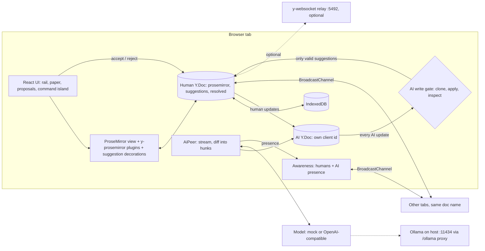

# Co-author developer guide

## 1. What it is

Co-author is a local-first rich-text editor. The AI is just another Yjs peer. It has its own client id, name, color and caret. It can only propose: every AI edit arrives as a tracked suggestion. A human accepts or rejects it. The AI never writes the text directly.

**Headline number:** 32 peers converge in 467.78 ms, and every AI write passes a gate that costs 1.114 ms on a 50,024 character document. Both numbers come from `pnpm bench`, saved in `bench/results.json` (AMD Ryzen 9 7900X, 24 cores, Node v24.18.0, Windows 10.0.26200, 2026-10-03).

Status: v0.1 is done and verified on 2026-10-04. 109 unit and integration tests in 20 files pass. 2 Playwright tests pass.

## 2. Quickstart (5 minutes)

You need Node 24 and pnpm 9.12 (`corepack enable`). Docker Desktop and Ollama are optional.

```bash
cd co-author
pnpm install
pnpm dev                 # open http://localhost:5490
```

1. Open http://localhost:5490 in two tabs.
2. Select a sentence. Type an instruction like "Cut filler words". Press Propose.
3. The mock AI streams a suggestion. Accept or reject each card.
4. Type in one tab. The text shows up in the other.
5. Turn on "Simulate offline" in both tabs. Edit both. Turn it off. Nothing is lost.

Useful URL flags: `?ai=mock` forces the mock model. `?doc=<name>` picks a document. `?relay=ws://localhost:5492` syncs across browsers through the relay.

To use a real model, open the model settings and pick the OpenAI-compatible backend. The default is Ollama with `qwen3.8:27b` at `/ollama/v1`. The dev server proxies that path to `localhost:11434`.

## 3. Architecture

Each tab holds one human `Y.Doc`. The AI peer holds its own `Y.Doc`. Every AI update goes through the gate before it reaches the human doc. The gate clones the doc, applies the update, and checks that only valid suggestion entries changed. If anything else changed, the update is dropped and the AI is quarantined.

Tabs sync over BroadcastChannel. There is no server. An optional y-websocket relay runs in Docker for cross-browser demos. IndexedDB keeps the document across reloads.



### Data model

| Root | Type | Written by | Content |
|---|---|---|---|
| `prosemirror` | `Y.XmlFragment` | humans (editor, accept) | One element per block (`paragraph` or `heading`), each with one `Y.XmlText`. |
| `suggestions` | `Y.Map<Suggestion>` | the AI (through the gate); humans delete on resolve | Plain JSON keyed by id, anchored with RelativePositions. |
| `resolved` | `Y.Map<Resolution>` | humans | Verdict, time, author, original and insert for each resolved id. |

A suggestion's state is derived on read. It is `streaming`, `ready` (the text still matches what the AI saw), `conflict` (the text changed) or `orphan` (the block is gone). Only `ready` can be accepted. Accept is one normal Yjs transaction, so Ctrl+Z undoes it.

### What the AI may and may not do

- It may set, overwrite or delete entries in `suggestions` that pass `validateSuggestion` and name its own client id.
- It may publish its own presence.
- It may not touch `prosemirror`, `resolved` or any other root. It may not spoof another author or send malformed entries. Each of these is rejected and quarantines the peer.

### Presence and tab count

Each tab publishes a human presence. The session forwards the AI's presence into the tab's awareness, so other tabs see the AI too. When a session is destroyed it clears its own awareness before closing the channel. On `pagehide` the tab sends a `bye`. A `bye` removes every awareness state that tab announced. If a tab dies without a `bye`, its states time out after 30 s and it drops out of the tab count. Two tabs that pick the same name rename the one with the larger client id.

## 4. Project layout

| Path | What it holds |
|---|---|
| `src/core/` | Schema and limits, anchored ranges, suggestion state, accept and reject, the AI write gate. |
| `src/ai/` | The AI peer, the mock model, the OpenAI-compatible streaming client, SSE parsing, the word diff. |
| `src/sync/` | BroadcastChannel provider (handshake, updates, awareness, bye) and IndexedDB persistence. |
| `src/editor/` | ProseMirror schema, Yjs-to-ProseMirror position mapping, selection scope, suggestion decorations. |
| `src/app/` | Session wiring, presence names and colors, the demo seed, settings. |
| `src/ui/` | React components and CSS tokens. |
| `tests/` | Vitest unit and integration tests (Node, jsdom for decorations). |
| `e2e/` | Playwright happy path and the demo recording spec. |
| `bench/` | `run.ts` and the measured `results.json`. |
| `scripts/make-demo-gif.mjs` | Turns the recorded video into `docs/demo.gif` with ffmpeg. |
| `deploy/nginx.conf`, `Dockerfile`, `docker-compose.yml` | Built app on nginx with the Ollama proxy, plus the optional relay. |
| `docs/adr/` | Architecture decision records. |

## 5. Run, test and benchmark

| Task | Command |
|---|---|
| Install | `pnpm install` |
| Dev server | `pnpm dev` (http://localhost:5490) |
| Unit and integration tests | `pnpm test` |
| Type check | `pnpm typecheck` |
| Build | `pnpm build`, then `pnpm preview` (http://localhost:5490) |
| End-to-end | `pnpm exec playwright install chromium` once, then `pnpm e2e` |
| E2E on another port | `E2E_PORT=5494 pnpm e2e` |
| Benchmark | `pnpm bench` (writes `bench/results.json`) |
| Demo GIF | `pnpm demo:record && pnpm demo:gif` (needs ffmpeg, mock model, port 5493) |
| Docker app | `docker compose up --build` (http://localhost:5491) |
| Docker relay | `docker compose --profile relay up` (ws://localhost:5492) |

If Docker cannot reach Ollama on the host, start Ollama with `OLLAMA_HOST=0.0.0.0`.

### Measured results (2026-10-03)

| Metric | Result | Target |
|---|---|---|
| Convergence, 32 peers, 100 edits and 2 gated AI suggestions each | 467.78 ms | under 1 s |
| Offline merge, 5000 edits per side | 17.66 ms (171,606 bytes) | under 250 ms |
| Gate, legal update, 50,024 chars | 1.114 ms | under 5 ms |
| Gate, legal update, 199,948 chars | 4.086 ms | none |
| Cross-tab latency (Node BroadcastChannel, not a browser) | median 0.087 ms, p95 0.146 ms | median under 5 ms |

Last verified run (2026-10-04): `pnpm test` 20 files, 109 passed. `pnpm build` ok. `pnpm e2e` 2 passed.

## 6. Key decisions and what they gave up

| Decision | Gave up |
|---|---|
| [0001](adr/0001-yjs-prosemirror-flat-schema.md) Yjs with raw ProseMirror and a flat block schema | Lists, tables and nested nodes. |
| [0002](adr/0002-suggestions-layer.md) Suggestions live in their own `Y.Map`, anchored by RelativePositions | Suggestions cannot span blocks. |
| [0003](adr/0003-ai-peer-gate.md) The AI is a separate `Y.Doc` behind a fail-closed gate | Each AI update clones the doc, so cost grows with doc size (4.086 ms at 200k chars). |
| [0004](adr/0004-sync-and-persistence.md) BroadcastChannel and IndexedDB, no server | Cross-device sync needs the optional relay. |
| [0005](adr/0005-accept-semantics.md) Accept applies only to the text the AI saw | Edited ranges become conflicts, and the user must ask again. |
| [0006](adr/0006-streaming-then-hunks.md) Stream one draft, then split it into word-level hunks | Hunks are word-level, not sentence-aware. |
| [0007](adr/0007-deterministic-seed.md) The demo seed is written by a fixed client id | A fixed, known id is reserved for seeding. |
| [0008](adr/0008-ui-stack.md) Plain CSS tokens and Phosphor icons | No Tailwind or motion library. |
| [0009](adr/0009-docker-and-ollama-proxy.md) Docker serves the built app, with an optional relay and a same-origin Ollama proxy | The relay uses `y-websocket@2.1.0` because the newer server package crashes. |
| [0010](adr/0010-host-port-range.md) Host ports 5490-5499 | Documents saved under the old `localhost:5175` origin do not show up on 5490. |

## 7. Known limits and what's left

Limits:

- Only headings and paragraphs. A suggestion stays in one block.
- If two peers accept the same suggestion at the same moment, both insert the text. The peers still agree, but the insert is doubled.
- Only the local AI peer is gated. Remote tabs are trusted.
- A tab that crashes without `pagehide` stays in the count for up to 30 s.
- The cross-tab latency number is from Node, not a browser.
- The demo GIF uses the mock model, not a real LLM.

Left for later:

- Gate updates from remote tabs per sender.
- Deduplicate concurrent double accepts.
- Multi-block suggestions and lists.
- Compact the `resolved` map.
- Sentence-aware hunks and a "re-ask" action for conflicts.
- Publish the gate and anchor core as an npm package.

Left for the user: add a GitHub remote and push (CI then runs from `.github/workflows/ci.yml`), choose a LICENSE, host a demo, and optionally re-record the GIF against Ollama.
